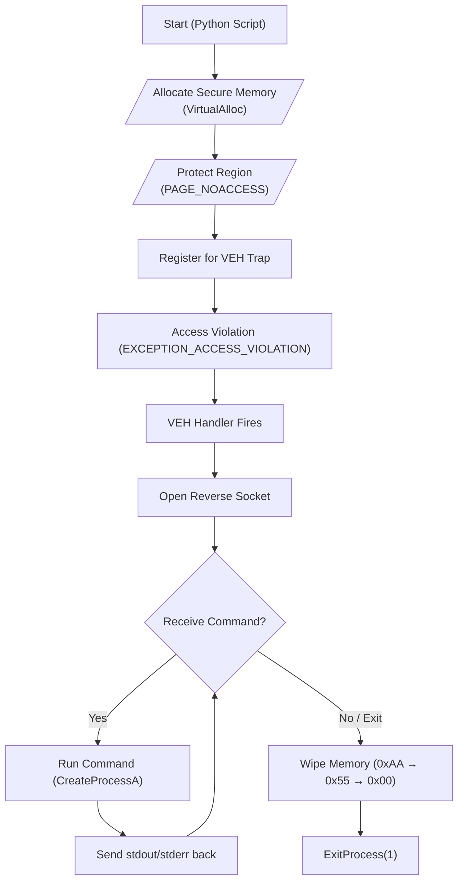

# I just wanted secure memory...
#### Or: How I Learned to Stop Worrying and Embrace `ctypes`
## The Beginning
This all started, like all bad ideas do, with **spirits and custom crypto**.  
I had this schema for entropy-based encryption using symmetric primitives to imitate asymmetric key behavior. No math, just chaos, `blake2b`, key schedules, and HMAC-based comparisons.
It worked well enough.
But then I thought:
> "Where do the secrets live? Oh... in memory."
### How I Got Pulled Into Memory Handling
Like all crypto tooling, **memory is the soft underbelly**.  
You can encrypt everything beautifully, but if someone scrapes RAM, it's over. To combat this, I started trying to **harden the memory**.  
That meant locking it, fencing it, and ideally wiping it if something went wrong.
> If you don't control your memory, someone else will.
> 
Naturally, I started with `mmap`.
### Why Didn't `mmap` work?
Because it's garbage for security.
- No clean `NOACCESS` protection
- No guaranteed page alignment on Windows
- No real pinning or fencing
- It's a file-backed buffer, not a secure allocator

What I really wanted was `mlock()` ... but I’m on Windows.
### What About `VirtualLock()`?
Oh boy.  
That thing is like a clown with a shotgun:
-   Sometimes it works
-   Sometimes it says it worked and **didn’t**
-   Sometimes the kernel silently ignores it

It's non-deterministic, inconsistently honored, and unsupported in several runtime contexts. It's the **10-gauge footgun** of Windows memory APIs.
### That Brought Me to `VirtualAlloc`
> **"Hey look, `mlock` for Windows."**

With `VirtualAlloc`:
-   I control the memory layout
-   I can page-align regions
-   I can `VirtualProtect` them to NOACCESS
-   I can `VirtualLock` them (and verify!)
-   I can zero them manually with `ctypes.memset()`

So I built around this, and that led to the creation of `pdgmemory`

Now I had **memory I trusted**.

### Feature Comparison
| Feature                     | **VirtualProtect** | **VirtualAlloc** | **mmap** | **mlock** | **mprotect** | **pdgmemory (mine)** |
| --------------------------- | -------------- | ------------ | ---- | ----- | -------- | ---------------- |
| Page Alignment              | ✅              | ✅            | ❌    | ✅     | ✅        | ✅                |
| Memory Wipe Control         | ✅              | ✅            | ❌    | ❌     | ❌        | ✅                |
| Protection Mode Switching   | ✅              | ✅            | ❌    | ❌     | ✅        | ✅                |
| Fault Trapping Support      | ❌              | ❌            | ❌    | ❌     | ❌        | ✅                |
| Python Integration (stdlib) | ❌              | ✅ via ctypes | ✅    | ✅     | ✅        | ✅                |

## So what even is VEH?

**VEH** is the _Vectored Exception Handler_. This is a low-level Windows construct that allows you to **trap access violations** (and other exceptions) **before** SEH (Structured Exception Handling) gets them.

If you `VirtualProtect` a region to `PAGE_NOACCESS`, and then someone tries to read/write it, you get an **access violation**.

With VEH, **you can intercept that**.

And I did.  
I just wanted to **wipe memory on tamper**.

And that’s where everything went beautifully, horribly wrong.

...Oops.

---
### Hmm...
If I have this moment between the memory fault and process death...
## Why not use SEH?
Because:
-   SEH is **language-level or compiler-managed** (think try/except at the machine level).
-   SEH is **overwritten or shadowed** by runtime (Python, C runtime, etc.)
-   VEH sits **under SEH**, and triggers **first**.
-   Also: **AV/EDR look at SEH. They ignore VEH.**
## Surely VEH is monitored, right?
> **NOPE.**

Unless you're **explicitly logging DebugStrings** or loading kernel shims:
-   **VEH is not monitored by default**
-   **Sysmon doesn’t see it**
-   **Windows Error Reporting doesn’t see it**
-   **CrowdStrike, SentinelOne, and Defender ignore it** (to my knowledge but I sure as hell can't see any detections of it)
-   Even if your handler opens a socket and runs `cmd.exe /c whoami`, The lights are on but **no one is watching.**
- No Error 1000
- No WER fault
- No minidump either
## What Is a C-Safe Function (and Why It Matters)?
This distinction matters because **any high-level Python call from inside VEH can crash the interpreter or trigger garbage collection mid-wipe.** That’s not safe. This is.

In this context:
-   **Doesn’t allocate Python objects**
-   **Doesn’t trigger GC**
-   **Doesn’t raise exceptions**
-   **Doesn’t call into Python interpreter internals**

Just:

-   `ctypes`
-   `windll.kernel32`
-   Maybe `ws2_32`
-   And pure WinAPI calls
    

It’s basically a **shellless shellcode runner that uses Python syntax**.
## Wait, so this intercepts after Python crashes but before the process terminates?

That space between:
-   Faulting instruction hits a NOACCESS page
-   And WER or Event Log catches the crash

I call it **crashtime**.

This process is already dead, it just doesn't know it yet.
I can:
-   Open a socket
-   Exfil memory
-   Run a command
-   Wipe everything
-   Exit cleanly

And **no one sees it happen.**
(If you're on the blue team, I'm sorry)

### Crashtime Diagram

### I'm Pretty Sure This Is the First Time This Has Been Done
It might exist in academia.  
I didn’t check. I’m not a professor. I’m an engineer.
## So how did you get ctypes to do this?
Very carefully:
-   Used `WINFUNCTYPE` to bind VEH handler
-   Set `restype`, `argtypes` manually
-   Declared `EXCEPTION_POINTERS` and `EXCEPTION_RECORD` structs
-   Used `AddVectoredExceptionHandler(1, handler)`
-   Then wiped memory, opened a socket, and waited for commands

In stdlib. No dependencies.
## There has to be some dependencies for this, right?
> **Nope.**

This is **pure Python**:
-   `ctypes`
-   `structs`
-   `os`, `sys`, `time`

No `pip install`. No `PyWin32`. No `shellcode`. No DLLs.
## How can I defend against this?
Honestly?
You don’t.

You could:

-   **Ban `ctypes`** ... but that breaks ~30% of packages
-   **Hook VEH** at the kernel level ... not trivial
-   **Watch for NOACCESS page faults → reverse socket** but there’s no existing rule set for this
-   **Audit Python packages for access to `AddVectoredExceptionHandler`** ... good luck
## What This Means for Python Security
This shows that:

- Python isn’t sandboxed just because it’s high-level
- `ctypes` gives access to everything the OS can do (by design)
- Fault paths are **executable free real estate**
- Security models that trust process-level abstraction are incomplete

## TL;DR

I used Python `ctypes` to install a Vectored Exception Handler.  
That handler triggers on memory access violations.  
When it fires, I:

- Run a command from a socket
- Wipe everything
- Exit cleanly

And nothing logs it.

**This is a reverse shell that lives in a crash.**  
And it uses nothing but stdlib.

> Oh yeah by the way? Metasploit Module coming soon ....
